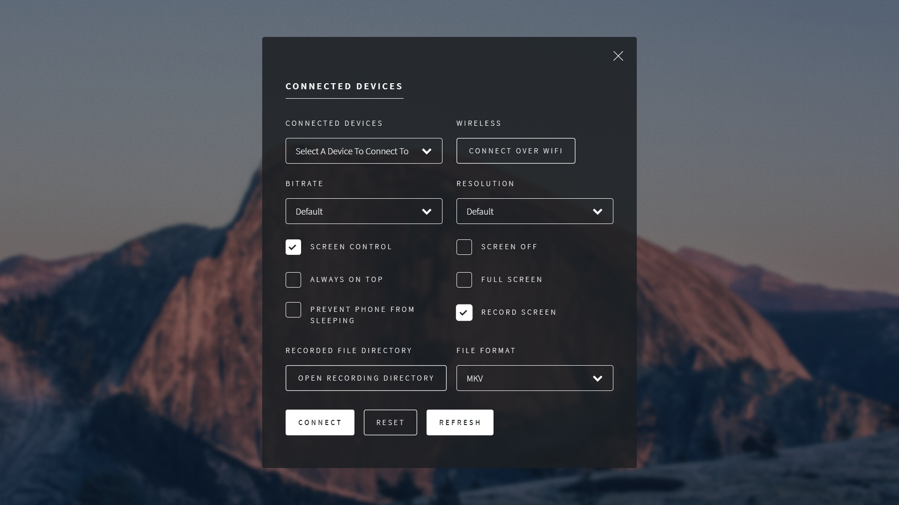

# Auto-CPY

---
GUI Client for [Scrcpy](https://github.com/Genymobile/scrcpy) and [Gnirehtet](https://github.com/Genymobile/gnirehtet) (Yet to be added) with auto-launch on device connect.

## Note:
1. Make sure you have your device's [__USB Debugging__](https://developer.android.com/studio/debug/dev-options) mode turned __ON__ (WiFi Support to be added soon.)
2. Connect your device to one of the USB ports on computer. 
3. Launch the Application.
#### If Auto launch on device connect is turned on, you will have to add an ___exclusion___ in windows defender.
Windows Defender detects it as a trojan (False Positive) and removes the executable because it has the auto launch on connect feature.
The application ___shortcut___ get placed in the startup applications folder `C:\Users\$USER\AppData\Roaming\Microsoft\Windows\Start Menu\Programs\Startup` to make the application run in background.

Adding a folder exclusion in Windows Defender will work.

__Windows Defender__ >> __Virus and threat protection__ >> __Manage settings__ >> __Add or remove exclusions__ >> __Add an exclusion__ >> __Select the program install directory__. (Default `C:\Program Files\Auto-CPY\`)

Check [__Releases__](https://github.com/fazalfarhan01/Auto-CPY/releases/) for more information

## Screenshots

## To compile and install on your own
1. Make sure you have Python Installed (Python 3.7.9 used for this project), and in path.
2. Clone this repository `git clone https://github.com/fazalfarhan01/Auto-CPY.git`
3. cd into the downloaded repo `cd Auto-CPY`
4. Create a virtual environment `virtualenv env`
    - You need to have virtualenv python package already installed. If not install it. `pip install virtualenv`
5. Activate the virtual environment `.\env\Scripts\activate`
6. Install all the required python packages `pip install -r requirements.txt`
7. Generate the exe file `python -m eel .\main.py .\web --onefile --icon=.\web\images\favicon.ico -n Auto-CPY.exe`
8. Move the generated `.exe` to main directory `mv .\dist\Auto-CPY.exe .`
9. Double click to run the `Auto-CPY.exe`. Alternatively Double click `run.vbs` to run without console.

## Technologies Used
1. Python (3.7.9)
2. HTML (UI)
3. CSS (UI)
4. JS (UI to Python)
5. [NSIS](https://en.wikipedia.org/wiki/Nullsoft_Scriptable_Install_System)
6. scrcpy
7. auto-adb
8. ~~gnirehtet~~ (not yet)